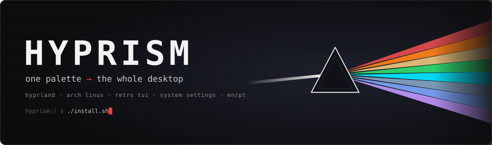
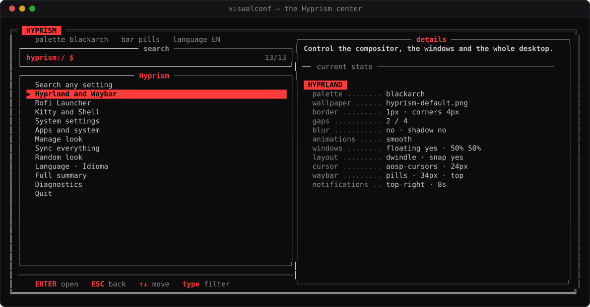
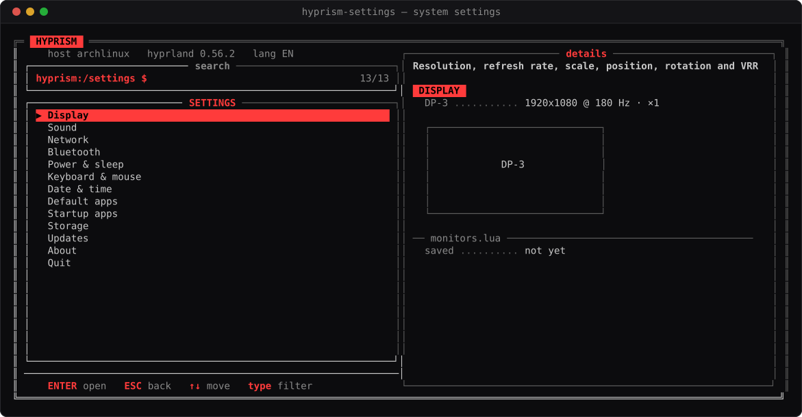
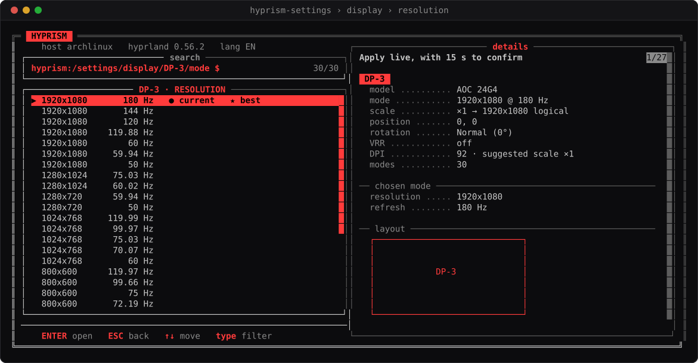
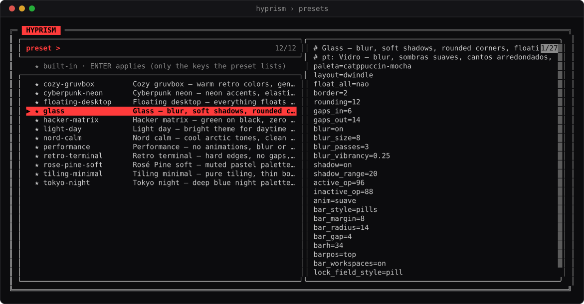
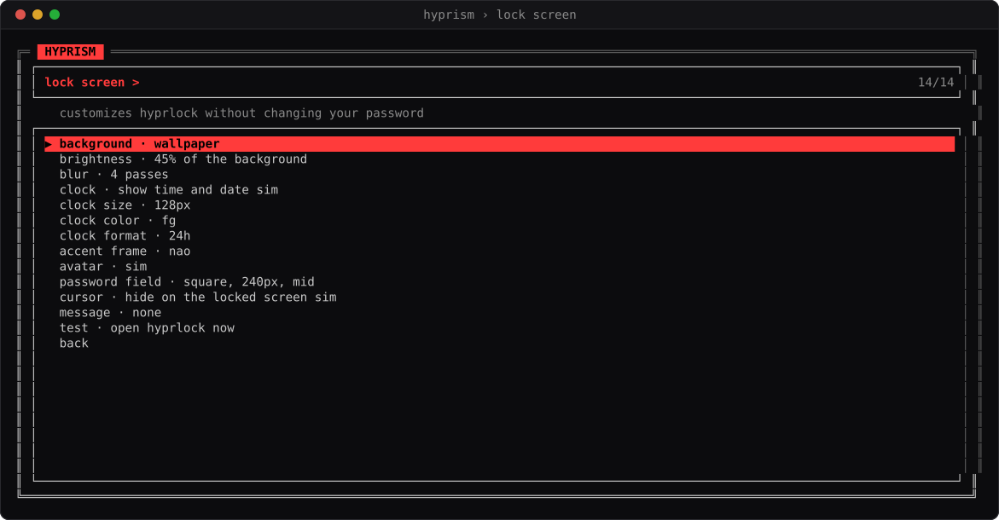
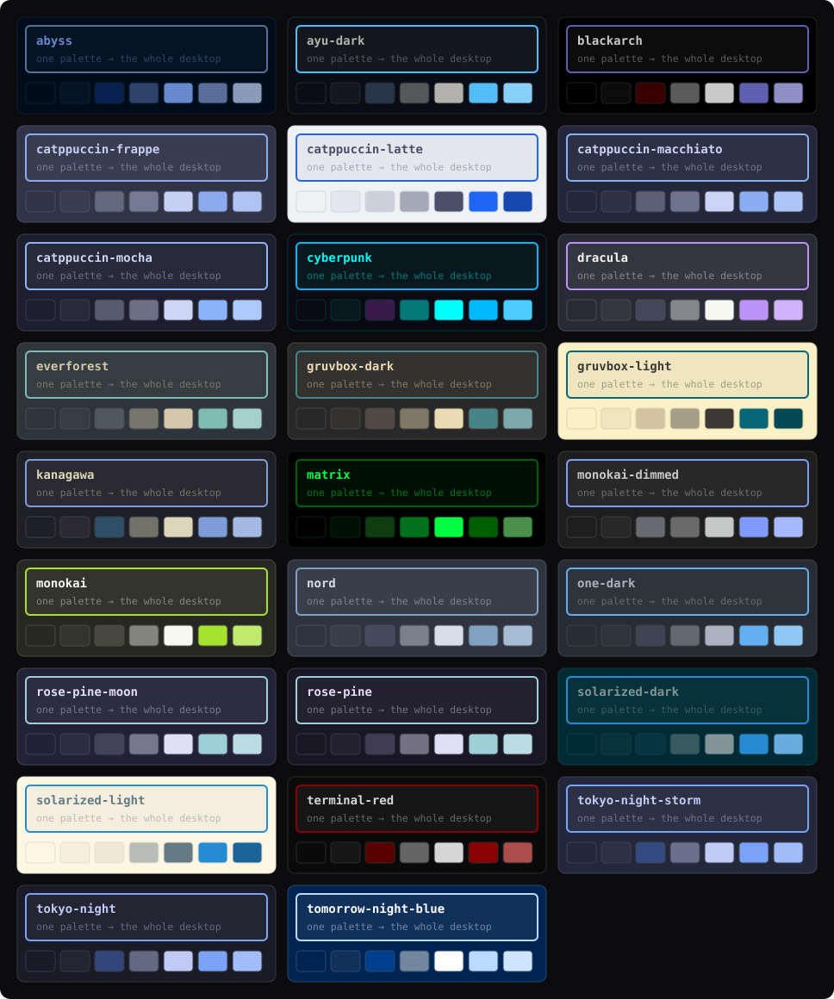

<p align="center">
  
</p>

<p align="center">
  
  
  
  
  
  
</p>

<p align="center">
  <b>Hyprism</b> turns a bare Hyprland on Arch Linux into a complete, coherent desktop —<br>
  bar, lock screen, notifications, launcher, terminal, right-click menu and a<br>
  <b>Windows-Settings-style system panel</b> — all driven from one retro terminal UI.
</p>

<p align="center">
  <a href="#install">Install</a> ·
  <a href="#what-you-get">Features</a> ·
  <a href="#screenshots">Screenshots</a> ·
  <a href="#palettes-and-presets">Palettes & presets</a> ·
  <a href="#everyday-use">Usage</a> ·
  <a href="#how-it-fits-together">How it works</a> ·
  <a href="#português">Português</a>
</p>

<p align="center">
  
</p>

---

## What you get

| | |
|---|---|
| **Hyprism center** — `visualconf` · `SUPER+H` | Every look setting in one place: palette, wallpaper with live preview, borders, gaps, blur, animations, bar, modules, lock screen, notifications, cursor, presets. |
| **System settings** — `hyprism-settings` · `SUPER+,` | Windows Settings, in the terminal: **display resolution, refresh rate, scale, position, rotation and VRR** with a 15-second keep/revert, sound devices, Wi-Fi, Bluetooth, power profile and sleep timers, keyboard and mouse, time zone, default apps, startup apps, storage cleanup, updates, about. |
| **26 palettes · 12 presets** | Catppuccin, Nord, Gruvbox, Tokyo Night, Rosé Pine, Dracula, Everforest, Kanagawa, Solarized, Matrix… and complete looks you apply in one command. |
| **Waybar** | Three bar styles — flat, pills, segmented — with margin, radius and gap tuning. Every module toggles on its own; colors always follow the palette, light palettes included. |
| **Lock screen** | hyprlock generated from the palette: wallpaper, image or solid background; clock size, color and 12/24 h; frame; avatar; message; password field style, width and position. |
| **Login screen** | Pick any installed SDDM theme with thumbnails; applied through a polkit prompt. |
| **Right-click menu** | A native GTK menu on the empty desktop: apps by category, terminals, browsers, Hyprism, System settings — and BlackArch tools when you have them. |
| **Quick & power menus** | `SUPER+I` for network, sound, Bluetooth and displays; `SUPER+ESC` to lock, log out, suspend, reboot or power off. |
| **Bilingual, live** | Every screen follows `hyprism lang en` / `pt`, switchable without restarting anything. |

## Screenshots

Real screens, captured from a terminal and rendered to SVG (`tools/ansi2svg.py`).

<table>
  <tr>
    <td width="50%"><br><sub><b>System settings</b> — twelve sections, live state on the right</sub></td>
    <td width="50%"><br><sub><b>Display</b> — every mode, current ● and best ★, applied live with auto-revert</sub></td>
  </tr>
  <tr>
    <td width="50%"><br><sub><b>Presets</b> — ready-made looks, previewed before you apply</sub></td>
    <td width="50%"><br><sub><b>Lock screen</b> — background, clock, frame, avatar, password field</sub></td>
  </tr>
</table>

## Install

**Requirements:** Arch Linux (or a derivative) and Hyprland ≥ 0.56 with a Lua config. The installer pulls everything else through pacman.

```bash
git clone https://github.com/jtave111/hyprism.git ~/dev/hyprism
cd ~/dev/hyprism
./install.sh            # pick components, review the transaction, confirm
```

| Option | Effect |
|---|---|
| `--yes` | Recommended components, no questions — never overwrites your own `hyprland.lua` |
| `--components core,hyprland,waybar,…` | Install exactly what you name |
| `--no-deps` | Skip package installation |
| `--dry-run` | Print every action, change nothing |
| `--lang pt` | Installer and Hyprism in Portuguese |
| `--uninstall` | Remove Hyprism's links and restore the configs it replaced |

**Components:** `core` (always) · `hyprland` · `waybar` · `launcher` (rofi) · `terminal` (kitty + starship) · `desktop-menu` · `lock` (hyprlock + hypridle) · `notify` (dunst) · `system` (NetworkManager, PipeWire, BlueZ) · `screenshot` · `extras` (animated wallpapers, power profiles, terminal previews).

> **Safe by design.** Every config the installer replaces is moved to `~/.config/hyprism/backups/install-<date>/` first, and every change is written to a manifest so `--uninstall` can put things back. Programs are symlinked into `~/.local/bin`, so a `git pull` updates Hyprism in place. If you already have your own `hyprland.lua`, it stays; Hyprism's is saved next to it as an example.

### Try it in a virtual machine

Boot the Arch ISO in VirtualBox, QEMU/KVM or VMware and run, as root in the live console:

```bash
loadkeys br-abnt2   # only for ABNT2 keyboards
curl -fsSLo i.sh https://raw.githubusercontent.com/jtave111/hyprism/main/tools/vm-install-arch.sh
bash i.sh
```

It installs Arch + Hyprland + SDDM + the guest tools (UEFI or BIOS), clones Hyprism to `~/dev/hyprism` and refuses to run outside a VM. Afterwards give the VM **3D acceleration and 128 MB of video memory**, log in, and run `./install.sh`.

## Palettes and presets

<p align="center"></p>

`hyprism <palette>` recolors Hyprland, Waybar, hyprlock, dunst, rofi and kitty at once. Presets go further and set the whole look — they never touch your keyboard, mouse, cursor or language:

| Preset | Look |
|---|---|
| `glass` | Blur, soft shadows, rounded corners, floating pill bar — Catppuccin Mocha |
| `tiling-minimal` | Pure tiling, thin borders, no blur, fast animations — Nord |
| `retro-terminal` | Hard edges, no gaps, monochrome with one accent — a 90s console |
| `floating-desktop` | Everything floats like KDE or macOS, shadows, bottom bar |
| `performance` | No animations, blur or shadows — for gaming and older hardware |
| `cozy-gruvbox` | Warm retro colors, gentle rounding, segmented bar |
| `cyberpunk-neon` | Neon accents, elastic animations, glowing pills |
| `tokyo-night` | Deep blue night palette, smooth animations, subtle blur |
| `rose-pine-soft` | Muted pastels, rounded and airy |
| `nord-calm` | Cool arctic tones, clean and quiet |
| `light-day` | Bright theme for daytime work |
| `hacker-matrix` | Green on black, zero chrome, keyboard-first |

## Everyday use

```bash
visualconf                 # the Hyprism center (also: hyprism with no arguments)
hyprism-settings display   # jump straight to a settings section
hyprism preset list        # ready-made looks
hyprism preset glass       # apply one
hyprism tokyo-night        # switch palette
hyprism -r                 # random palette
hyprism style pills        # bar style: flat | pills | segmented
hyprism lang pt            # interface language: en | pt
hyprism sddm               # login screen theme picker
hyprism -h                 # every command
```

### Keybindings

| Keys | Action | Keys | Action |
|---|---|---|---|
| `SUPER+SPACE` | App launcher | `SUPER+RETURN` · `SUPER+K` | Terminal |
| `SUPER+H` | Hyprism center | `SUPER+,` | System settings |
| `SUPER+I` | Quick menu | `SUPER+W` | Network |
| `SUPER+ESC` | Power menu | `SUPER+L` | Lock |
| `SUPER+Q` | Close window | `SUPER+SHIFT+Q` | Exit Hyprland |
| `SUPER+F` · `SUPER+M` | Fullscreen · maximize | `SUPER+V` · `SUPER+T` | Float window · whole workspace |
| `SUPER+D` · `SUPER+SHIFT+D` | Minimize · restore all | `SUPER+C` | Center window |
| `SUPER+←↑↓→` | Focus | `SUPER+SHIFT+←↑↓→` | Snap to half screen |
| `SUPER+CTRL+←↑↓→` | Resize | `SUPER+ALT+←↑↓→` | Move |
| `SUPER+1…0` | Workspace | `SUPER+SHIFT+1…0` | Send window |
| `SUPER+[` · `]` | Focus monitor | `SUPER+SHIFT+[` · `]` | Send to monitor |
| `SUPER+P` | Region screenshot | `PRINT` · `SUPER+SHIFT+S` | Screen · region to clipboard |
| `SUPER+B` | Restart the bar | `SUPER+scroll` | Resize (`+ALT`: workspaces) |

## How it fits together

You never hand-edit generated files. Hyprism owns a small set of files and `hyprland.lua` only reads them — each with a fallback, so nothing breaks before Hyprism has run.

| File | Written by | Read by |
|---|---|---|
| `~/.config/hypr/themes/.state` | every Hyprism tool — the single source of truth | Hyprism |
| `~/.config/hypr/colors.lua` · `look.lua` | `hyprism render` | `hyprland.lua` |
| `~/.config/hypr/monitors.lua` | System settings → Display | `hyprland.lua` |
| `~/.config/hyprism/autostart` | System settings → Startup apps | `hyprland.lua` |
| `~/.config/hypr/hyprlock.conf` · `hypridle.conf` | `hyprism render` · System settings → Power | hyprlock · hypridle |
| `~/.config/waybar/style.css` + module lines | `hyprism render` | Waybar |
| `~/.config/dunst/dunstrc` | `hyprism render` | dunst |
| `~/.config/rofi/…` · `~/.config/kitty/…` | `rofitheme` · `kittytheme`, synced from the palette | rofi · kitty |

> **Lua config note.** With `hyprland.lua`, `hyprctl keyword …` and raw `hyprctl dispatch <name>` stop working. Hyprism applies live changes with `hyprctl eval '<lua>'`, for example `hyprctl eval 'hl.monitor({ output = "DP-1", mode = "2560x1440@165" })'`.

<details>
<summary><b>Repository layout</b></summary>

```
bin/        hyprism · visualconf · hyprism-settings · control-center · hyprism-desktop
            hyprism-power · hyprism-launcher · hyprism-open · rofitheme · kittytheme
            wifi-menu · set-wallpaper · restart-waybar
lib/ui.sh   the shared retro TUI style — every screen looks like one program
configs/    hyprland.lua and Waybar templates deployed by the installer
palettes/   26 palettes (.env)            presets/   12 ready-made looks
share/      kitty themes, Starship prompts, rofi layouts — seeded on first run
tools/      ansi2svg.py and palettes-svg.py, which build the images in this README
```
</details>

## Troubleshooting

- **Monitor stuck at 60 Hz** — `hyprism-settings display`, pick the refresh rate; it applies live and is kept once you confirm. Monitors you never configured already default to their highest refresh rate.
- **NVIDIA** — `hyprland.lua` sets `LIBVA_DRIVER_NAME`, `__GLX_VENDOR_LIBRARY_NAME` and `NVD_BACKEND` when the NVIDIA driver is loaded; install `libva-nvidia-driver` for hardware video decode.
- **A screen shows the wrong language** — `hyprism lang en` or `pt`; every Hyprism screen reads the same setting.
- **Something looks off** — `visualconf doctor` checks dependencies, files and config syntax without changing anything.

## Português

**Hyprism** transforma um Hyprland recém-instalado no Arch num desktop completo e coerente, controlado por uma interface de terminal com visual retrô. Inclui barra, tela de bloqueio, notificações, launcher, terminal e menu do botão direito, além de um painel de **Configurações do sistema** no estilo do Windows: resolução e Hz, som, rede, Bluetooth, energia, data e hora, apps padrão, inicialização, armazenamento e atualizações.

```bash
git clone https://github.com/jtave111/hyprism.git ~/dev/hyprism
cd ~/dev/hyprism && ./install.sh --lang pt
```

Tudo o que o instalador substitui vai antes para `~/.config/hyprism/backups/`, e `./install.sh --uninstall` restaura. Troque o idioma a qualquer momento com `hyprism lang pt` (ou `en`). São 26 paletas e 12 visuais prontos: `hyprism preset list`.

## License

MIT — see [LICENSE](LICENSE).
